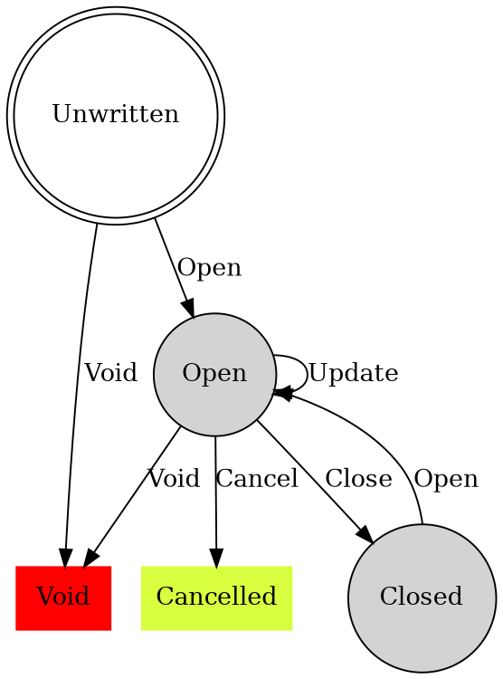

# StatePattern

An example of the State design pattern in C#

State Transition Diagram ([copy here](http://www.webgraphviz.com/)):

```graphviz
digraph PolicyState {
  size="8,5"
  node [shape = doublecircle]; Unwritten;
  node [shape = rectangle style=filled]; Void Cancelled;
  node [shape = circle];
  Unwritten -> Open [ label = "Open" ];
  Unwritten -> Void[ label = "Void" ];
  Open -> Cancelled [ label = "Cancel" ];
  Open -> Closed [label = "Close" ];
  Open -> Open [label = "Update"];
  Open -> Void [label = "Void"];
  Closed -> Open [label = "Open"];
  Void [color="0.000 1.000 1.000"];
  Cancelled [color="0.201 0.753 1.000"];
}
```

