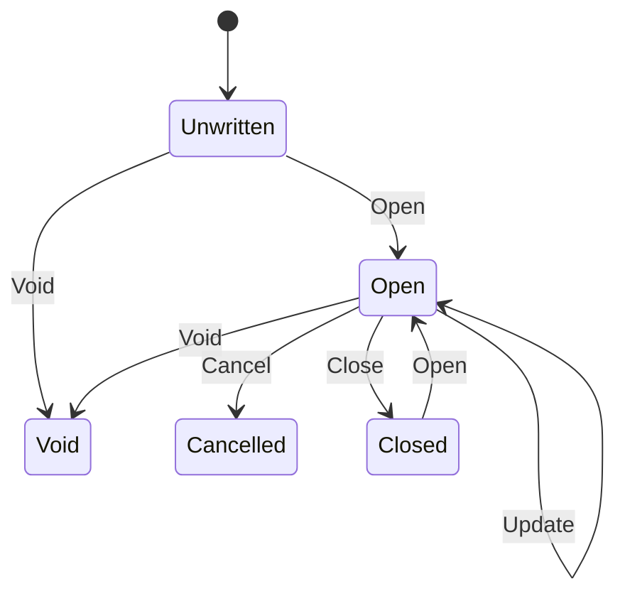

# State Design Pattern

An example of the State design pattern in C#.

New Mermaid syntax:

State Transition Diagram ([copy here](http://www.webgraphviz.com/)):

## Notes

The State pattern is described in the Core project and tested in the unit tests. The web project doesn't yet do anything useful. Pull requests welcome to help visualize the pattern.

Added a GitHub Action that eventually will build and run tests.

